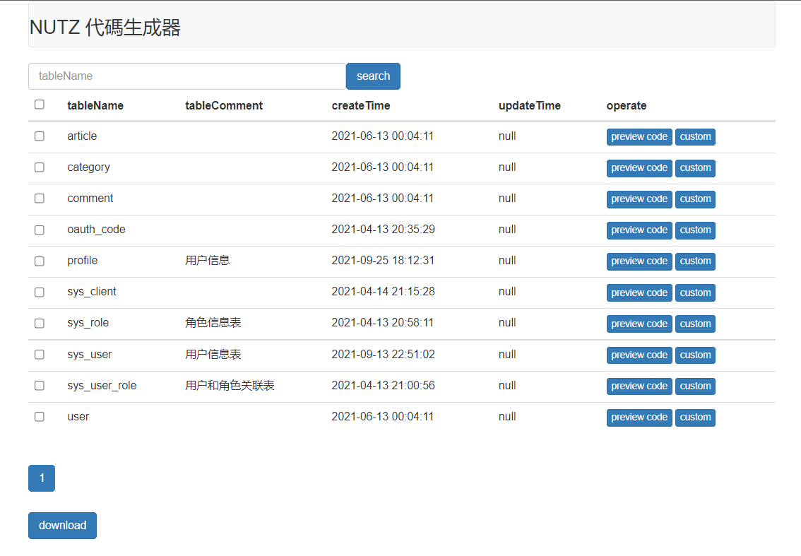
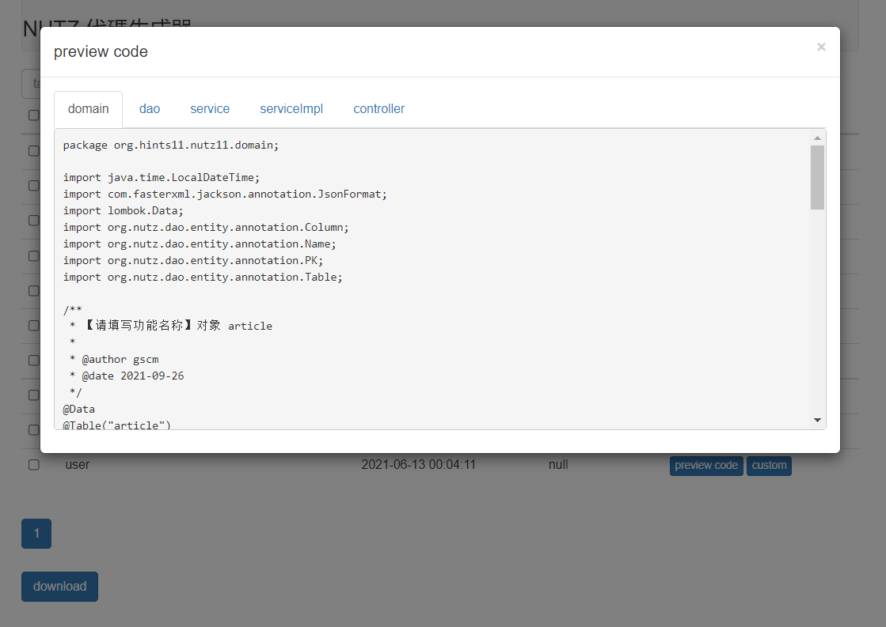
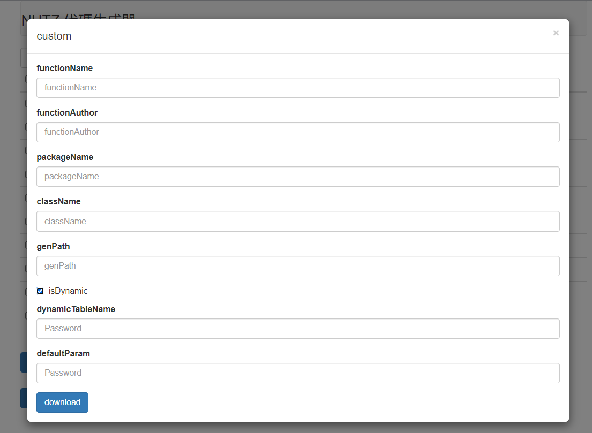

# Nutz-Code-Generator
#### 介绍
本项目是基于NutzDao的代码生成器

NutzDao是针对 JDBC 的薄封装，事务模板，无缓存

`注：仅支持单表CRUD，未支持外键关联`

[Nutz官网链接](http://www.nutzam.com/ "Nutz")







#### 使用说明
##### 配置数据源src/main/resources/application.properties
```properties
server.port=8084
spring.datasource.username=hints
spring.datasource.password=hints
spring.datasource.url=jdbc:mysql://47.119.167.118:3306/art_db?serverTimezone=UTC&useUnicode=true&characterEncoding=utf-8&useSSL=false&allowPublicKeyRetrieval=true
spring.datasource.driver-class-name=com.mysql.cj.jdbc.Driver
spring.thymeleaf.prefix=classpath:/views/
spring.thymeleaf.suffix=.html
spring.thymeleaf.cache=false
```
##### 配置代码生成器src/main/resources/generator.yml
```properties
# 代码生成
gen:
author: gscm
# 默认生成包路径 system 需改成自己的模块名称 如 system monitor tool
packageName: org.myjob.nutz
# 自动去除表前缀，默认是false
autoRemovePre: false
# 表前缀（生成类名不会包含表前缀，多个用逗号分隔）
tablePrefix: sys_
```